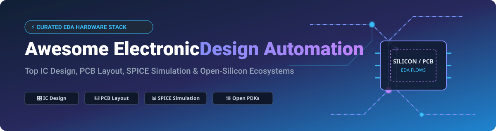

# Awesome Electronic Design Automation (EDA) ⚡

  

  
  
  
  
  

## 📌 Top Electronic Design Automation (EDA) Platforms & Open-Silicon Ecosystem 🌐

> **Curated Directory of Commercial SaaS Platforms & Open-Source GitHub Repositories for IC Design, Analog Simulation, PCB Layout, and Silicon Verification** 🔌

**Last updated: September 2026** 📅

Welcome to the ultimate awesome list for **Electronic Design Automation (EDA)**! This repository tracks premier commercial **SaaS platforms** and high-impact **open-source projects** spanning integrated circuit (IC) design, printed circuit board (PCB) layout, SPICE simulation, static timing analysis (STA), process design kits (PDKs), and open silicon flows. These tools empower chip designers, hardware engineers, researchers, and embedded systems developers to create, simulate, verify, and manufacture custom silicon and production PCBs. 🚀

---

## 📑 Table of Contents

- [☁️ SaaS & Hosted Commercial Platforms](#-saas--hosted-commercial-platforms)
- [🔓 Open-Source GitHub Projects](#-open-source-github-projects)
  - [🖥️ Digital IC Design (RTL to GDSII)](#️-digital-ic-design-rtl-to-gdsii)
  - [📐 Analog & Mixed-Signal IC Design](#-analog--mixed-signal-ic-design)
  - [🔌 PCB Design & Layout](#-pcb-design--layout)
  - [🔍 PCB Analysis & Multiphysics Verification](#-pcb-analysis--multiphysics-verification)
  - [⚡ HDL Simulation & Verification](#-hdl-simulation--verification)
  - [💎 Open PDKs (Process Design Kits)](#-open-pdks-process-design-kits)
  - [🛠️ Design Automation & Layout Utilities](#️-design-automation--layout-utilities)
  - [📦 Additional Open-Source EDA Options](#-additional-open-source-eda-options)
- [📈 Star History](#-star-history)
- [🤝 How to Contribute](#-how-to-contribute)
- [❤️ Support & Sponsorship](#️-support--sponsorship)
- [⚠️ Disclaimer](#️-disclaimer)

---

## ☁️ SaaS & Hosted Commercial Platforms

### 📊 Market Size & Industry Structure Analysis 💡
> The global **Electronic Design Automation (EDA)** market size is estimated at **$16.5 Billion (2026)** and is projected to reach **$28.4 Billion by 2032** growing at a CAGR of ~9.4%. The commercial EDA industry is **highly concentrated** (an oligopoly / winner-take-most structure), where the top 3 giants (**Synopsys**, **Cadence**, and **Siemens EDA**) command over **75% of total market revenue**, driven by extreme R&D barriers, complex IP ecosystems, and tight foundry signoff partnerships.

| Platform / SaaS 🏢 | Enterprise Scale / Valuation 💰 | Starting Pricing Tier 💵 | Free Tier / Trial Limit ⏳ | Key Capabilities & Overview 🛠️ |
| :--- | :--- | :--- | :--- | :--- |
| **[Synopsys Fusion Compiler](https://www.synopsys.com/)** | **~$82.5 Billion** Market Cap / **~$6.1B** Revenue | ~$35,000 / user / year (Enterprise License) | 30-day evaluated Cloud Trial via Synopsys Cloud (restricted to evaluation PDKs) | Dominant RTL-to-GDSII implementation platform combining synthesis, place-and-route, and timing optimization for advanced silicon nodes. |
| **[Cadence Virtuoso](https://www.cadence.com/)** | **~$78.0 Billion** Market Cap / **~$4.6B** Revenue | ~$25,000 / user / year (On-prem / Cloud subscription) | No free tier; 14-day evaluation demo for verified corporate clients | Industry-standard custom IC design platform for analog, RF, and mixed-signal custom silicon circuits. |
| **[Siemens EDA Xpedition](https://eda.sw.siemens.com/)** | **~$145.0 Billion** (Siemens AG Parent Market Cap) | ~$15,000 / license / year | 30-day full-featured free trial for Xpedition Enterprise Cloud | Enterprise multi-board PCB design platform providing schematic capture, high-speed layout, signal integrity, and manufacturing signoff. |
| **[Ansys RedHawk](https://www.ansys.com/)** | **~$28.5 Billion** Market Cap / **~$2.3B** Revenue | ~$20,000 / engine license / year | 14-day evaluation trial for engineering teams upon sales contact | Multi-physics power integrity and electromigration (EM/IR) signoff analysis platform for semiconductor IC designs. |
| **[Keysight ADS](https://www.keysight.com/)** | **~$27.0 Billion** Market Cap / **~$5.4B** Revenue | ~$12,000 / license / year | 30-day free trial license with restricted RF component library export | Advanced Design System (ADS) for RF, microwave, high-speed digital design, and 3D electromagnetic co-simulation. |
| **[Altium 365](https://www.altium.com/)** | **~$30.0 Billion** (Acquired by Renesas Electronics) | ~$3,850 / user / year (Altium 365 Standard + Designer) | 15-day full access free trial; Free Personal Workspace for viewer collaboration | Cloud-connected PCB design platform enabling real-time co-design, 3D visualization, component management, and cloud manufacturing. |
| **[Zuken CR-8000](https://www.zuken.com/)** | **~$850 Million** Market Cap | ~$8,500 / seat / year | 30-day evaluation trial via authorized Zuken enterprise partners | 3D multi-board PCB and IC package co-design platform tailored for complex electronic systems and vehicle electronics. |
| **[Silvaco SmartSpice](https://silvaco.com/)** | **~$350 Million** Market Cap | ~$6,000 / seat / year | 30-day evaluation license upon corporate verification | High-performance analog and mixed-signal circuit simulator for SPICE modeling, Monte Carlo, and custom IC verification. |
| **[Aldec Riviera-PRO](https://www.aldec.com/)** | **~$120 Million** Private Revenue / Valuation | ~$4,500 / seat / year | 30-day free evaluation trial license for verification engineers | Advanced HDL simulation and verification platform supporting VHDL, Verilog, SystemVerilog, UVM, and SystemC. |
| **[EasyEDA Pro](https://easyeda.com/)** | **~$80 Million** Valuation (JLCPCB Parent) | ~$9.90 / user / month (Pro Standard Edition) | **Free Forever** basic tier (Unlimited private projects, 2-layer PCB limits, 1,000 cloud components) | Accessible cloud-based schematic capture and PCB layout editor directly linked to JLCPCB manufacturing and component libraries. |

---

## 🔓 Open-Source GitHub Projects

### 🖥️ Digital IC Design (RTL to GDSII)

- **[Yosys](https://github.com/YosysHQ/yosys)**  — Framework for Verilog RTL synthesis. Converts Verilog code to gate-level netlists for FPGA and ASIC flows. Serves as the core synthesis engine of open-source digital silicon toolchains. **ISC License**. 🛠️
- **[OpenROAD](https://github.com/The-OpenROAD-Project/OpenROAD)**  — Complete RTL-to-GDSII application implementing place-and-route, floorplanning, CTS, static timing analysis, and PDNSim power analysis. **BSD-3-Clause**. 🛣️
- **[OpenLane](https://github.com/The-OpenROAD-Project/OpenLane)**  — Automated silicon design flow from RTL to GDSII using OpenROAD, Yosys, and Magic. Native support for SKY130, GF180MCU, and IHP SG13G2 PDKs. **Apache-2.0**. 🤖
- **[OpenSTA](https://github.com/parallaxsw/OpenSTA)**  — Gate-level static timing analysis (STA) engine designed for high-performance timing signoff in digital IC design flows. **GPL-3.0**. ⏱️

---

### 📐 Analog & Mixed-Signal IC Design

- **[KLayout](https://github.com/KLayout/klayout)**  — High-performance GDSII/OASIS layout viewer and editor with DRC, LVS, and parasitic extraction support via Python/Ruby scripting APIs. **GPL-3.0**. 🔍
- **[Magic VLSI](https://github.com/RTimothyEdwards/magic)**  — Classic interactive custom IC layout editor providing real-time Design Rule Checking (DRC), layout extraction, and LVS verification. **BSD-3-Clause**. 🪄
- **[Xschem](https://github.com/StefanSchippers/xschem)**  — Hierarchical schematic capture editor optimized for custom analog, RF, and mixed-signal VLSI chip design. Netlists to SPICE, VHDL, and Verilog. **GPL-2.0**. ✏️
- **[Ngspice](https://github.com/ngspice/ngspice)**  — Mixed-level SPICE circuit simulator incorporating XSPICE and CIDER extensions. Features DC, AC, transient, and digital co-simulation modes. **BSD-3-Clause**. ⚡
- **[Xyce](https://github.com/Xyce/Xyce)**  — High-performance parallel circuit simulator developed by Sandia National Laboratories for large-scale transistor signoff simulation. **GPL-3.0**. ⚛️

---

### 🔌 PCB Design & Layout

- **[KiCad](https://gitlab.com/kicad/code/kicad)**  — Industry-leading open-source PCB suite with schematic capture, 32-copper-layer layout, push-and-shove router, 3D STEP viewer, and Ngspice integration. **GPLv3**. 🎛️
- **[Fritzing](https://github.com/fritzing/fritzing-app)**  — User-friendly electronics design application for breadboard prototyping, schematic creation, and beginner-friendly PCB layout. **GPLv3**. 🎨
- **[atopile](https://github.com/atopile/atopile)**  — Code-first PCB design framework allowing engineers to describe circuit boards using modern software languages, modules, and version control. **MIT**. 💻
- **[LibrePCB](https://github.com/LibrePCB/LibrePCB)**  — Intuitive C++/Qt EDA suite for schematic entry and PCB layout featuring modular component management and clean file specifications. **GPLv3**. 📦
- **[tscircuit](https://github.com/tscircuit/tscircuit)**  — TypeScript and React framework for building real electronic circuit boards using code, automated autorouting, and web rendering. **MIT**. ⚛️
- **[Horizon EDA](https://github.com/horizon-eda/horizon)**  — Feature-complete EDA suite built from scratch for flexible schematic capture, component management, and high-speed PCB design. **GPL-3.0**. 🌅

---

### 🔍 PCB Analysis & Multiphysics Verification

- **[OpenEMS](https://github.com/thliebig/openEMS)**  — Electromagnetic field solver utilizing the FDTD method for signal integrity, power integrity, and RF antenna analysis on PCBs. **GPL-3.0**. 📡
- **[OpenFASOC](https://github.com/idea-fasoc/OpenFASOC)**  — Autonomous analog layout generators (e.g. glayout) providing PDK-agnostic programmatic generation of analog circuits in Python. **Apache-2.0**. 🤖

---

### ⚡ HDL Simulation & Verification

- **[Verilator](https://github.com/verilator/verilator)**  — High-speed Verilog/SystemVerilog simulator that compiles HDL code into cycle-accurate optimized C++/SystemC models. **LGPL-3.0 / Artistic-2.0**. ⚡
- **[Icarus Verilog](https://github.com/steveicarus/iverilog)**  — Established Verilog IEEE-1364 simulation and synthesis engine for digital verification and ASIC testing. **GPL-2.0**. 🐊
- **[GHDL](https://github.com/ghdl/ghdl)**  — Comprehensive VHDL analyzer and simulator supporting VHDL-1987 through VHDL-2019 standards with LLVM/GCC backend support. **GPL-2.0**. 📑
- **[Cocotb](https://github.com/cocotb/cocotb)**  — Coroutine-based co-simulation verification framework for writing VHDL and Verilog RTL testbenches in pure Python. **BSD-3-Clause**. 🐍
- **[NVC](https://github.com/nickg/nvc)**  — High-performance VHDL compiler and simulator with native experimental Verilog mixed-language co-simulation capabilities. **GPL-3.0**. 🚀

---

### 💎 Open PDKs (Process Design Kits)

- **[SkyWater SKY130 PDK](https://github.com/google/skywater-pdk)**  — 130nm open-source commercial PDK created by Google and SkyWater Technology for public microelectronics manufacturing. **Apache-2.0**. 🌊
- **[IHP SG13G2 Open PDK](https://github.com/IHP-GmbH/IHP-Open-PDK)**  — 130nm SiGe BiCMOS open PDK from IHP Leibniz Institute designed for high-frequency RF and mixed-signal silicon production. **Apache-2.0**. 🔬
- **[GlobalFoundries GF180MCU PDK](https://github.com/google/gf180mcu-pdk)**  — 180nm bulk CMOS open-source PDK targeting 3.3V/6V microcontroller processes from Google and GlobalFoundries. **Apache-2.0**. 🌐

---

### 🛠️ Design Automation & Layout Utilities

- **[nextpnr](https://github.com/YosysHQ/nextpnr)**  — Portable FPGA place-and-route tool framework supporting Lattice iCE40, ECP5, Gowin, and Nexus architectures. **ISC**. 🧩
- **[gdsfactory](https://github.com/gdsfactory/gdsfactory)**  — Python library for algorithmic layout generation of photonic, analog, RF, MEMS, and quantum integrated circuits. **MIT**. 🐍
- **[F4PGA](https://github.com/chipsalliance/f4pga)**  — Fully open-source toolchain for FPGA architecture development and bitstream generation under CHIPS Alliance. **Apache-2.0**. 🏗️
- **[eSim](https://github.com/FOSSEE/eSim)**  — Open-source EDA tool for circuit design, simulation, analysis, and PCB design integrated with KiCad and Ngspice. **GPL-3.0**. 🎓
- **[CACE](https://github.com/efabless/cace)**  — Automatic circuit characterization engine for running multi-corner PVT simulations using specifications defined in YAML. **Apache-2.0**. 🧪
- **[IIC-RALF](https://github.com/iic-jku/IIC-RALF)**  — Reinforcement learning framework for automated analog circuit layout generation utilizing Magic as layout backend. **Apache-2.0**. 🧠
- **[Splice](https://github.com/Voidheart88/splice)**  — Ultra-fast SPICE simulator written in Rust, featuring parallel element evaluation and MessagePack remote execution. **Apache-2.0**. ⚡

---

### 📦 Additional Open-Source EDA Options

- **PCB Editors**: **pcb-rnd** (modular PCB layout editor), **eSim** (integrated circuit & PCB flow).
- **Analog & SPICE Simulators**: **Gnucap** (GNU circuit analysis package), **Splice** (parallel SPICE in Rust).
- **Physical Verification & LVS**: **Netgen** (LVS netlist comparison tool), **Magic** (DRC/Extraction engine), **KLayout** (DRC/LVS signoff).
- **FPGA Toolchains**: **Yosys + nextpnr** (open FPGA flow), **F4PGA** (formerly SymbiFlow).
- **Complete AMS Environments**: **IIC-OSIC-Tools** (Dockerized full-flow environment with Xschem, Ngspice, Magic, KLayout, and SKY130 PDK).

---

## 📈 Star History

---

## 🤝 How to Contribute

Contributions to expand and update this curated EDA list are warmly welcomed! 🌟

1. 🍴 **Fork** this repository.
2. 📝 **Add or edit** entries in `README.md` maintaining table and badge formatting.
3. 🔎 Ensure descriptions remain factual, concise, and include standard SPDX license tags.
4. 📬 Submit a **Pull Request** detailing your changes.

Check out our full collection of awesome resources at [Awesome-Awesome-Awesome](https://github.com/ishandutta2007/Awesome-Awesome-Awesome)! 🚀

---

## ❤️ Support & Sponsorship

If you find this Electronic Design Automation directory helpful in your hardware or silicon projects, please consider supporting the project! 💖

- ⭐ **Star this repository** to help others discover open-source EDA tools.
- 🔀 **Fork and share** it with your hardware, chip design, and PCB engineering communities.
- ☕ **Buy me a coffee / Sponsor**: Support ongoing maintenance on the [GitHub Sponsor Dashboard](https://github.com/sponsors/ishandutta2007).

---

## ⚠️ Disclaimer

- This directory is **community-curated** for educational and reference purposes. It does not constitute commercial endorsement.
- **Open-Source vs. Enterprise Signoff**: The open-source EDA ecosystem has achieved remarkable milestones, delivering fully functional silicon chips (such as TinyWhisper in IHP 130nm). However, commercial suites (Cadence, Synopsys, Siemens EDA) remain dominant for ultra-advanced silicon nodes (<5nm), high-frequency RF signoff, and certified tapeouts.

---

  <b>Designed for Microchip Designers, PCB Engineers, Silicon Innovators & Open-Hardware Advocates.</b> ⚡ 
  <i>Let's make electronic design automation more open, accessible, and powerful for everyone!</i>

